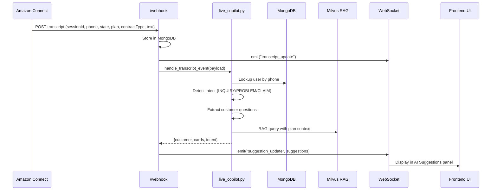

# Live Copilot Real-Time Suggestion System

## Architecture



## Implementation Steps

### 1. Modify Webhook to Extract Session Context

**File:** `app.py` (webhook endpoint ~line 5039)

Update the webhook to extract phone, state, plan, contractType from the payload and store in session context:

```python
# Extract session context from payload
session_context = {
    "phone": data.get("phone"),
    "state": data.get("state"),
    "contractType": data.get("contractType"),
    "plan": data.get("plan"),
}
```

### 2. Add Socket.IO Handlers for Copilot Enable/Disable

**File:** `app.py` (after `join_session` handler ~line 5093)

Add handlers that the frontend already tries to emit:

```python
@socketio.on("copilot_enable")
def on_copilot_enable(data):
    session_id = data.get("sessionId")
    if session_id:
        with _copilot_sessions_lock:
            _copilot_enabled_sessions[session_id] = time() + _copilot_session_ttl_seconds()
            _copilot_session_context[session_id] = {
                "contractType": data.get("contractType"),
                "selectedPlan": data.get("selectedPlan"),
                "selectedState": data.get("selectedState"),
            }

@socketio.on("copilot_disable")
def on_copilot_disable(data):
    session_id = data.get("sessionId")
    if session_id:
        with _copilot_sessions_lock:
            _copilot_enabled_sessions.pop(session_id, None)
            _copilot_session_context.pop(session_id, None)
```

### 3. Integrate live_copilot Module in Webhook

**File:** `app.py`

Import the module at the top:

```python
from live_copilot import handle_transcript_event
```

Modify webhook to call copilot processing and emit suggestions:

```python
# After storing transcript and emitting transcript_update:
# Process through Live Copilot (if enabled)
try:
    copilot_payload = {**data, **session_context}
    result = handle_transcript_event(copilot_payload)
    if result:
        socketio.emit("suggestion_update", result)
        socketio.emit("suggestion_update", result, room=session_id)
except Exception as e:
    print(f"Copilot processing error: {e}")
```

### 4. Update live_copilot.py for New Payload Format

**File:** `live_copilot.py`

Update `_update_session_context_from_payload()` (~line 144) to read new fields:

```python
def _update_session_context_from_payload(st, payload):
    # Read directly from payload (new format)
    st.contract_type = st.contract_type or _s(payload.get("contractType"))
    st.selected_plan = st.selected_plan or _s(payload.get("plan"))
    st.selected_state = st.selected_state or _s(payload.get("state"))
    
    # Also store phone for user lookup
    phone = _s(payload.get("phone"))
    if phone and not st.customer:
        doc = _lookup_user_by_phone([phone])
        if doc:
            st.customer = _normalize_customer_doc(doc, phone)
```

### 5. Enhance Suggestion Generation for CSR Scripts

**File:** `live_copilot.py`

The existing `_call_suggest_llm()` already generates professional suggestions. Verify the prompt includes:

- Concise, calm tone
- Actionable scripts for CSR
- Coverage decision (Yes/No/Partial)
- Policy evidence citations

### 6. Enable Copilot Feature Flag

**File:** `.env` or environment

```
ENABLE_LIVE_COPILOT=1
```

## Key Files Modified

| File | Changes |

|------|---------|

| `app.py` | Import live_copilot, add Socket.IO handlers, integrate in webhook |

| `live_copilot.py` | Update payload parsing for new format |

## Testing

1. Start backend with `ENABLE_LIVE_COPILOT=1`
2. Open Analyze Live UI, login to Amazon Connect
3. Connect a call - copilot_enable fires automatically
4. Send test webhook with phone/state/plan/contractType
5. Verify User Details card populates
6. Customer asks coverage question
7. Verify AI Suggestions panel shows response