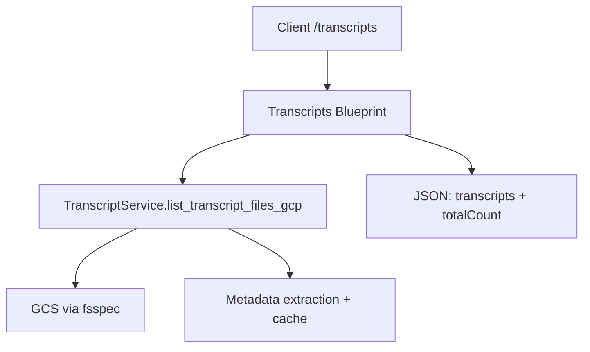
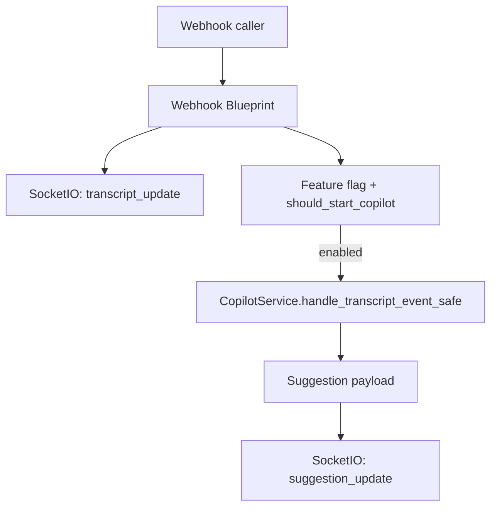

# Modular Architecture for Contract PDF QnA (Backend)

## Overview
The backend has been restructured toward a modular Flask architecture using an application factory, blueprints, and a service/repository split. A new package lives at `contract-pdf-qna/app/` and is the primary entrypoint via `main.py`. The legacy `app.py` remains for reference and gradual migration, but new development should target the modular package.

## Architecture Principles
- **Application factory**: `app.create_app()` builds the Flask app with env-driven `Settings`.
- **Blueprint isolation**: Health, transcripts, and webhook/copilot live in dedicated blueprints.
- **Service layer**: Business logic for transcripts and copilot orchestration is in `app/services/`.
- **Dependency injection**: Extensions (`socketio`, Mongo, GCS, embeddings) are initialized centrally in `app/extensions.py`.
- **Fail-soft AI tools**: Copilot integration is optional and guarded by feature flags.
- **Testability**: Storage and AI clients are initialized lazily to support isolated tests.

## Complete Folder Structure
- `app/__init__.py` – app factory, blueprint registration, public exports (socketio, transcripts helpers).
- `app/config.py` – `Settings` dataclass for env configuration.
- `app/extensions.py` – shared extensions (SocketIO, Mongo, GCS fsspec, embeddings, tracing).
- `app/routes/health.py` – liveness endpoint.
- `app/routes/webhook.py` – transcript webhook + live copilot emission.
- `app/routes/transcripts.py` – transcript listing API.
- `app/services/transcript_service.py` – GCS listing + metadata extraction helpers.
- `app/services/copilot_service.py` – safe wrapper around `live_copilot.handle_transcript_event`.
- `app/utils/` – auth helper, transcript filter re-exports.
- `main.py` – run server with `socketio.run(create_app())`.
- `app.py` – legacy monolith retained for historical reference (to be phased out).

## Layer-by-Layer Explanation
- **Routes (Blueprints)**: Minimal request handling, parameter parsing, JSON responses.
- **Services**: Encapsulate business logic (GCS transcript listing, copilot orchestration).
- **Extensions**: Centralized clients for SocketIO, Mongo, GCS, embeddings; lazily initialized to support tests and offline dev.
- **Utils**: Cross-cutting helpers (auth verification, transcript filtering wrappers).

## API Endpoints
| Endpoint | Method | Module | Notes |
| --- | --- | --- | --- |
| `/health` | GET | `app/routes/health.py` | Liveness probe |
| `/transcripts` | GET | `app/routes/transcripts.py` | Paginated transcript listing (GCS) |
| `/webhook` | POST | `app/routes/webhook.py` | Transcript event broadcast + optional copilot |
| Legacy endpoints | various | `app.py` | Remaining routes to be migrated incrementally |

## Service Dependencies
- **TranscriptService** (`app/services/transcript_service.py`)
  - Depends on `fsspec` GCS filesystem (lazy init), env `GCP_BUCKET_NAME`, `GCP_PROJECT_ID`.
  - Uses cached metadata extraction to avoid re-reading files.
- **CopilotService** (`app/services/copilot_service.py`)
  - Optional `live_copilot` module; guarded to fail-soft when unavailable.
- **Extensions** (`app/extensions.py`)
  - SocketIO async mode auto-detects `eventlet` or env override.
  - Mongo client (`FrontDoorDB`) only if `MONGO_URI` is set.
  - Embeddings only if `OPENAI_API_KEY` is set.

## Data Flow Examples

## Migration Status
- **Completed**: App factory, core extensions, health + transcripts + webhook blueprints, copilot wrapper, transcript service extraction, new `main.py` entrypoint, env-driven settings.
- **In progress**: Migrating remaining legacy routes (calls, feedback, sidebar, conversations, transcript processing streams), socket events, and deeper service/repository splits (Mongo, Milvus, JWT auth).
- **Pending**: Full live copilot module decomposition, vector store services, auth/JWT utility consolidation, and removal of legacy globals.

## File Size Comparison (approximate, lines)
- Legacy `app.py`: ~7,053 lines (unchanged, legacy reference).
- New modular package:
  - `app/__init__.py`: ~60
  - `app/extensions.py`: ~80
  - `app/routes/*`: ~180 combined
  - `app/services/*`: ~260 combined
  - `main.py`: ~20
These will evolve as remaining routes migrate from the legacy file.

## Import Patterns
- Use `from app import create_app, socketio` for runtime entry.
- For transcript helpers in tests: `from app import list_transcript_files_gcp, gcs_fs, GCP_BUCKET_NAME`.
- Service-level imports stay within `app/services/...` to avoid circular deps; blueprints import services only.

## Testing Structure
- Legacy tests remain under `contract-pdf-qna/tests/`.
- New app is test-friendly: storage clients lazy-init; auth helper isolated in `app/utils/auth.py`.
- Recommended fixtures: `create_app()` factory per test module; monkeypatch GCS and Mongo clients as needed.

## Deployment
- Entry: `python main.py` (uses SocketIO’s `run` wrapper).
- Environment: `.env` or shell vars for OpenAI, Mongo, GCS, JWT, Motorhead.
- SocketIO async mode auto-detected; override with `SOCKETIO_ASYNC_MODE`.
- Legacy Docker scripts can be updated to call `main.py`; current compose remains compatible with legacy until switched.
